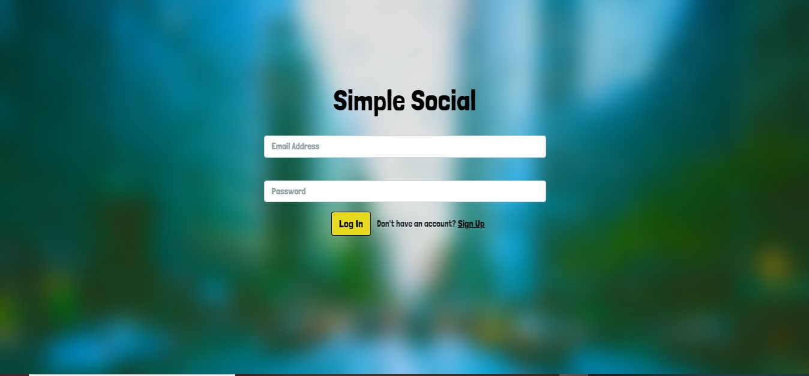
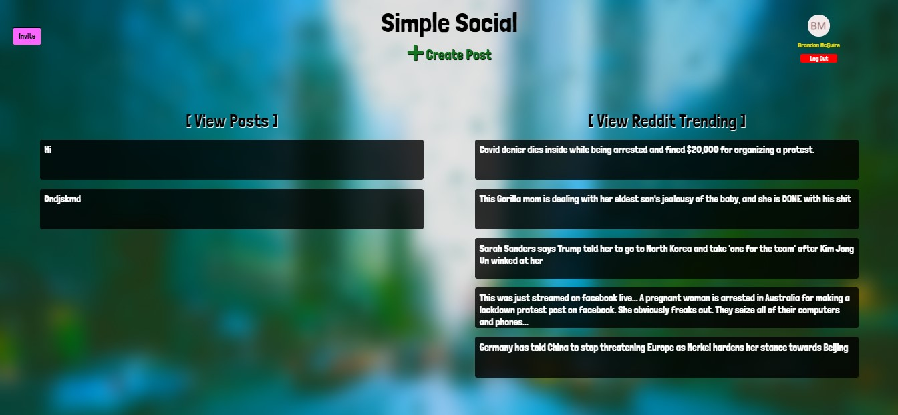
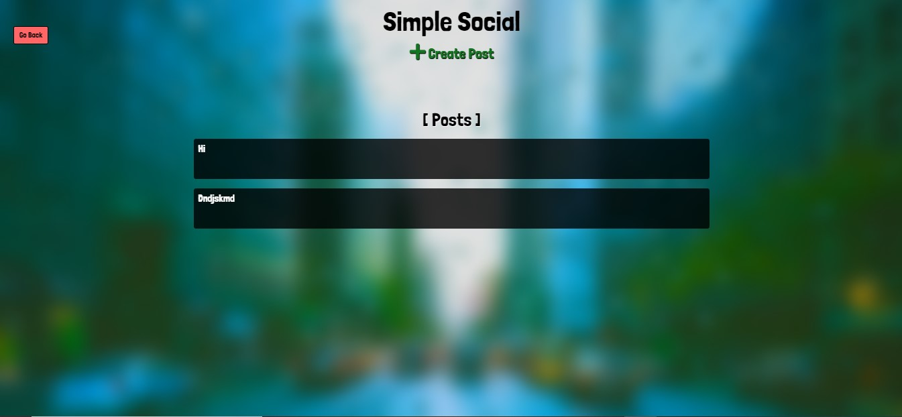

# Simple Social

Welcome to the new social media app, Simple Social. A place where you can post your hearts most desires or just look at Reddit's top trending. You can create new post and edit or delete existing post. Give it a shot!!

[Heroku Link](https://simple-social-fullstack.herokuapp.com/)

## User Story

AS A social media user I WANT to post text, photos, videos, etc to a user-friendly website SO THAT my friends/family can view them without a lot of extra noise.

## App Images

### Login Page

### Signup Page

### Homepage

### Post Page

### Trending Page

## Contributors

[Tom Breazier](https://github.com/tbreazier)

[Matt Linden](https://github.com/geocode-matt)

[Zach Wagner](https://github.com/ZachWagner1)

[Brandon McGuire](https://github.com/brandonmcguire1992)
